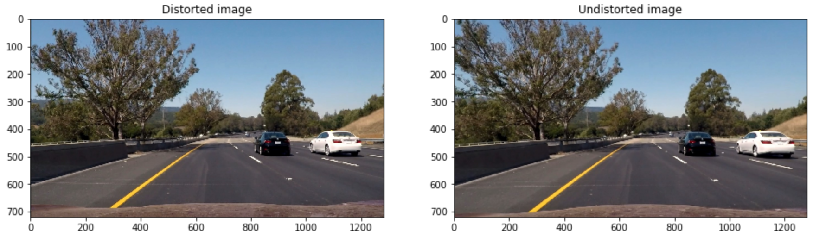
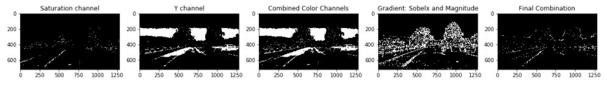
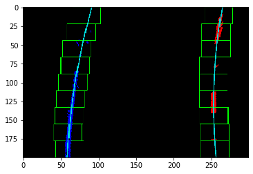
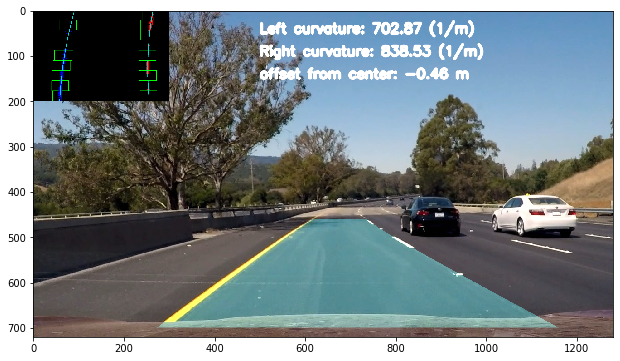

# Advanced Lane Finding

Advanced road lane finding based on conventional image processing methods.

## Undistorting Images

To eliminate the effect of camera lense, I use OpenCV and chessboard images from different angles and distances to find distortion matrix and calibration coefficient. For this purpose, two arrays, namely objpoints and imgpoints, are defined. Objpoints stores the 3D points of the real world, but since we are taking 2D reference, z value is alway set tozero in this case. Imgpoint stores the values of found corners in each chessboard image. The corners are appended each time to the end of the imgpoints array. The function used to find the corners is cv2.findChessboardCorners and the function to calculate distortion matrix is cv2.calibrateCamera. After finding the calibration coefficent, a function named undistort() is defined, which accepts an image and outputs the undistorted one. Here is the result of such transformation on a sample image:

 

## Single image pipline

In this section, I will go though the steps to find the lane pixels, calculate the curvature and overlay information on the original image.

### Thresholding
In this step, S channel thresholding (HSL) as well as Y channel threshold (YUV) is used to isolate among others the line pixels. Moreover, I use gradient in x and y direction as well as the gradient magntiude to find the lane pixels. In the last step, the combination of these two is used to get the best results. In the image below, the effect of each step is shown for an autobahn image from the project. This step is implemented in code cell number 3 and 4. A function called binary_lanes() is defined to apply these filters to an input image.

### Image wraping

The code for warpping of an image is in cell number 5. Here by try and error, I chose the following source and destination points:

Source | Destination | Corner
-------| -------     |-------
[270, 700]| [250, 720] |Bottom left
[595, 460]| [250, 0] |Top left
[725, 460]| [1065, 0] |Top right
[1130, 700]| [1065, 720] |Bottom right

and then I used these points to calculate wraping transform M: src -> dst and its inverse M_inv: dst -> src using cv2's getPerspectiveTransform() function. Moreover, I defined a function named warp() which gets an input image and applies the wrapping to it by using cv2's warpPerspective function. In the image below, the result is shown for both original and binary images:

### Lane finding and poly fit

Function find_lanes() takes an image as an input and also two more optional inputs, namely polyfits for left and right lanes. It normally applies the undistort, thresholding and warping functions to an input image first. Then it checks the polyfit inputs, if they are empty it uses the moving_box() function to find the lane pixels. Otherwise, it uses the polyfit inputs to search for lane pixes in the vicinity of the lines designated by these polyfits, which is implemented in function find_in_vicinity(). If the number of pixels found in this search, are too low or they are too scattered, it will again activate the moving_box() function again. To transfer the polyfits for next image process, it saves them as a dictionary using the pickle module of python. This last feature will be used in the video pipeline when processing many images, as for single image, this feature comes not in use. Below shows a picture of the sliding windows and found pixels as well as fitted lines. Moreover, this function makes use of a function called histogram_max() to find the pixel location for the peak value of left and right lanes in lower half of the image.

### Curvature calculation
Curvature caluclation for each lane is done though a function named measure_curvature_meters(). The function accepts as input left and right lane pixels, recalculates the polyfits in meters and calculates the curvatures based on curvature formula in meters.

### Image overlay
Overlay of information is done through a function called overlay_lanes_to_image(), which accepts found lanes as input and does the following:

* Fills a poly between the two lanes to mark the area between them
* Transforms the filled poly using inverse wrapping M_inv and overlay it on the original image using cv2.Addweighted function.
* Takes the image with found lane pixels and sliding windows, makes it small and add it to the top right corner of the original image.
* Calculate the offset of the car to the lane center by assuming that horizental middle of the image, is the middle of the lane.
* Adds the offset and also the curvature values to the original image

Below is an image of the final result:

## Video Pipeline

For the video pipeline, a function named pipeline() is defined, which accepts a video as input and doe the following:

1. Loads the fittness paramteres using pickle
2. Applies find_lanes() function
3. Applies overlay_lanes_to_image() function
4. Outputs the result

[Output of the Project video](project_video_out.mp4)

## Suggestions and future work

* From the output video it can be seen that there is lane jump, especially in the far away position. One way to tackle this is to take an average of the lane position over several frames, as a reference for comparison.

* It would be a good idea to keep track of lane properties like curvature and lane distance to detect anamolies and abrupt changes before drawing the lanes back to the original frame.

